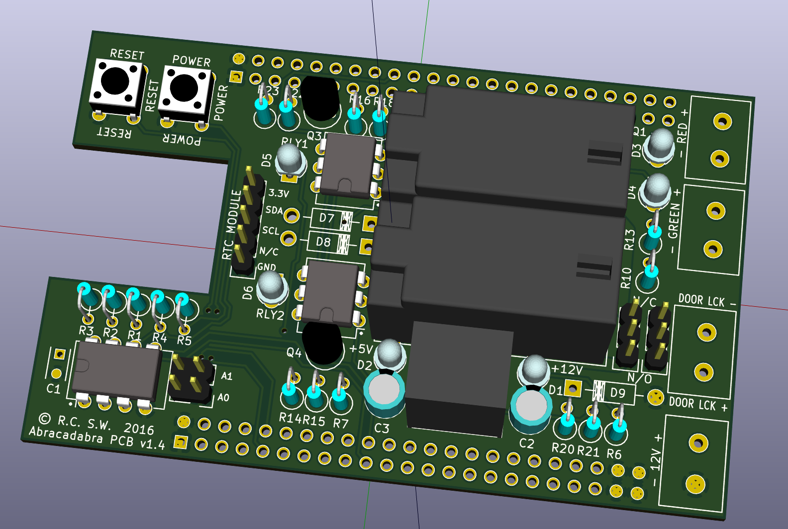

# BeagleBone Black Door Cape
This is a BeagleBone Black Cape designed for electronically locking or
unlocking a single door.  It can control either a 12V door strike or
a 12V door magnet.

The cape has the following features:
* Dual relays to ensure door is closed if a relay fails
* opto-isolated GPIO inputs for detecting door status and/or relay failure
* Jumpers for configuring door strike or door magnet (NO/NC)
* on-board voltage regulator so BBB can be powered via 12V
* connectors for two external software controlled 12V lamps
* LED indicators for 12V, 5V, relay engagement, and external lamps
* 24C256 EEPROM w/ address configurable via jumpers
* headers for an RPi/Arduino-compatible realtime clock module

